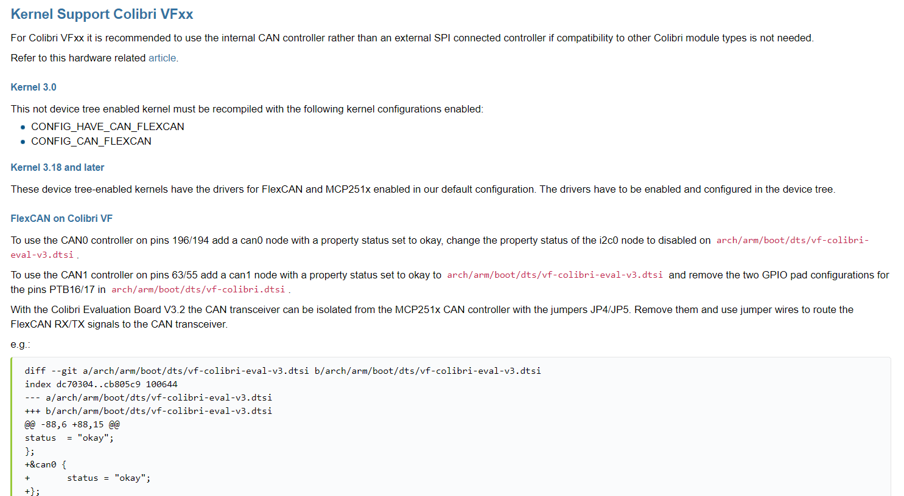
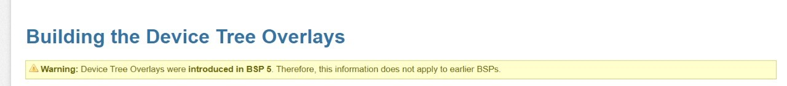
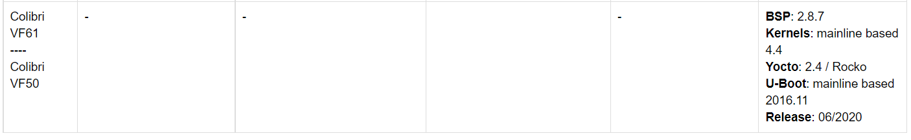
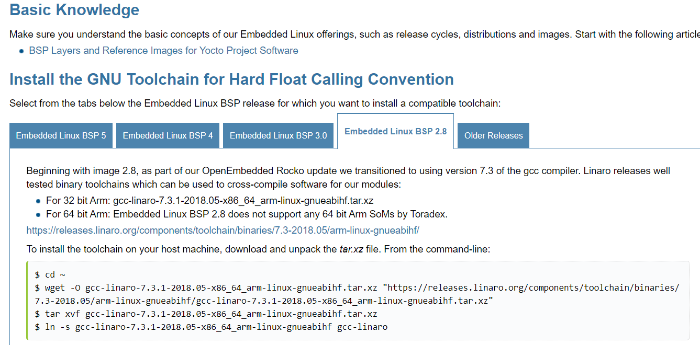
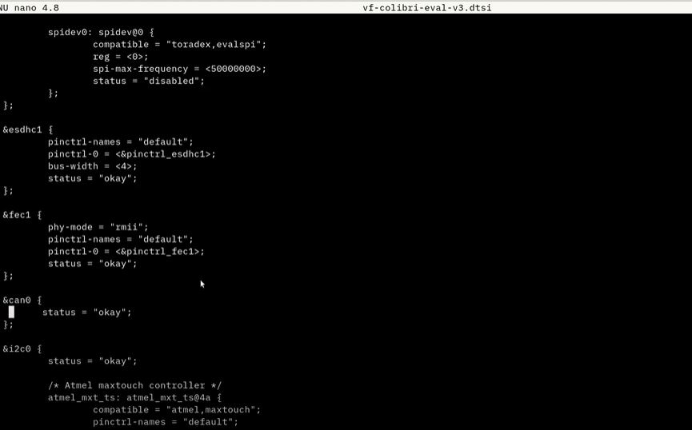
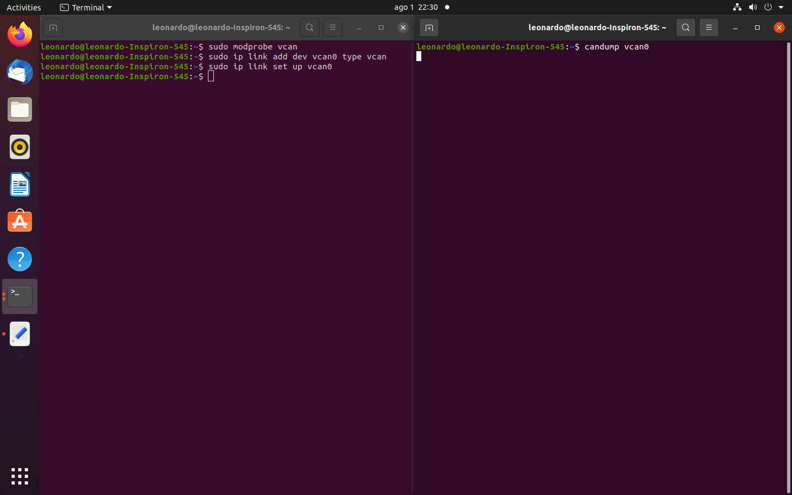
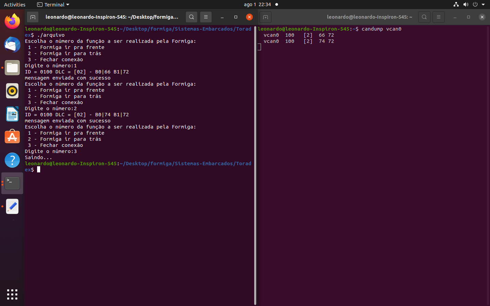
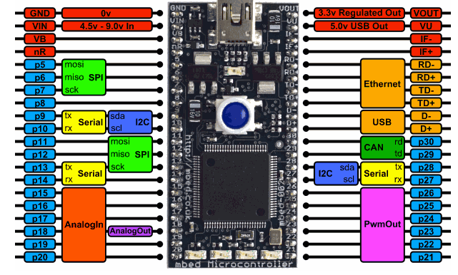

# Implementação do Protocolo CAN para placa Toradex Colibri VF50 e Mbed - Controle da Formiga Mecatrônica

<h2 align="center"> SEM0544 - Sistemas Embarcados

</h2>

<h3 align="center"> 
  
Universidade de São Paulo 

Escola de Engenharia de São Carlos 

Departamento de Engenharia Elétrica e Computação 
 
 

</h3>

<h3 align="center"> 
</h3>
  
Professores: 

**Glauco Augusto de Paula Caurin** 

**Daniel Varela Magalhães**

Alunos:

**[Gustavo Batistom Vasquez](https://github.com/gustavobvasquez)** *n° USP: 9805150* 

**[Leonardo Ferreira Rosa Zago](https://github.com/leonardozado)** *n° USP: 9805355* 

**[Leonardo Rodrigues de Ávila Oliveira](https://github.com/Leonardorodriguesoliveira)** *n° USP: 9805205* 

<h5 align="center"> 
  
31 de julho de 2021

</h5>

# 1) Objetivos
  O projeto se baseia no funcionamento de 12 motores PWM que realizam a movimentação da formiga mecatrônica através de utilização de sistemas embarcados. Para isso, o objetivo foi desenvolver a comunicação, através do protocolo de comunicacão CAN, entre uma placa com linux embarcado (Toradex VF50) e a placa da Mbed (LPC1768), onde os motores estarão conectados as portas PWM. Desta forma o projeto tem a flexibilidade de contar com um sistema operacional, para inclusão de diversas funcionalidades futuras, e também pode-se utilizar do poder de processamento existênte na Mbed. 

# 2) Materiais e métodos
  Para a realização do projeto, foram utilizadas a placa Colibri VF50 da Toradex e 2 placas Mbed LPC1768. O diagrama de blocos a seguir demonstra a estrutura de comunicação desde a placa com o S.O. embarcado até a informação de PWM dos motores.
  
  </h3>

<h3 align="center"> 
</h3>

  O fluxo de funciomento será da seguinte forma, a placa da toradex envia uma mensagem de funcionamento via protocolo Can para as placas da Mbed. Recebendo esta informação a placa da Mbed executa a rotina programada para controle dos PWM de acordo com a mensagem recebida (Levantan, Anda para frente, Abaixa, Vire a direita, etc.)
  
  

# 3) Desenvolvimento

## 3.1) Habilitação dos pinos para comunicação CAN Colibri VF50 (CAN0)

O problema todo consiste (e o grupo nao conseguiu resolvê-lo por completo ao final) em habilitar a comunicação CAN0 na placa. Entretanto, tal problema será discutido e várias etapas executadas com sucesso serão discutidas no decorre desta sessão. Ao executar o comando a seguir na placa Toradex, pôde-se evidenciar que a comunicação can não se encontra habilitada por default, sendo necessários diversos passo que o grupo realizou a fim de tentar solucionar a questão.

<h3 align="center"> 
</h3>

Inicialmente, o grupo encontrou um documento no site do fabricante da placa (Toradex) relatando algumas alterações necessárias para a adaptação da placa para emitir e receber protocolos de comunicação CAN. (segue o link de referência: https://developer.toradex.com/knowledge-base/can-linux#tab-bsp-5). Nele se evidenciam dois maneira diferentes de alterar alguns arquivos na placa para habilitar a forma de comunicação CAN0 entre os pinos 196/194 ou CAN1, utilizando-se dos pinos 63/55.

<h3 align="center"> 
</h3>

Adicionalmente, dessa mesma fonte, encontrou-se a informação que devido à versão do kernel linux disponível em nossa placa Colibri VF50 não é possível realizar device tree overlay, que são fragmentos especiais de device trees que permitem que você substitua partes específicas, antes de inicializar o sistema operacional. Ou seja, desse modo é possível aproveitar diversas camadas de software de uma placa semelhante e realizar apenas adequações necessárias ao kernel em uma camada mais exterior, aproveitando grande parte do que já foi desenvolvido e adaptado por outros desenvolvedores.

<h3 align="center"> 
</h3>

Para o download da respectiva Cross Toolchain necessária, identificou inicialmente a versão do Embedded Linux BSP para uso da versão adequada. Realizando a consulta no artigo (segue o link de referência: https://developer.toradex.com/knowledge-base/embedded-linux-release-matrix) foi possível identificar a versão BSP: 2.8.7 do Linux em nossa placa. 

<h3 align="center"> 
</h3>

Em seguida, acessou-se o link para download da Cross Toolchain correspondente (segue link de referência: https://developer.toradex.com/knowledge-base/build-u-boot-and-linux-kernel-from-source-code#tab-embedded-linux-bsp-28). E realizou-se o donwload do software de compilação conforme indicado pelas linhas de comando abaixo.

<h3 align="center"> 
</h3>

Acessou-se o github da Toradex para encontrar o arquivo mencionado no artigo inicial. Acessando o caminho mencionado e mudando a versão para a toradex_vf_4.4, encontrou-se o arquivo arch/arm/boot/dts/vf-colibri-eval-v3.dtsi. Como foi encontrado referências mencionando o melhor uso de CAN0 para o nosso propósito, optou-se por essa opção. Nesse arquivo é possível identificar o status do nó de CAN0 que é necessário desabilitar o status do nó i2c0 e também setar o status do nó can0 para okay. Obersevação importante: os pinos 196/194 estão disponíveis fisicamente (no hardware) através dos pinos 5/6 respectivamente do expansion header da carrier board Viola.

O repositório foi clonado para que as mudanças mencionadas pudessem ser realizadas, utilizando-se do comando $ git clone -b toradex_vf_4.4 git://git.toradex.com/Linux-toradex.git (para clonar o nosso branch específico desejado). E as mudanças mencionadas anteriormente foram realizadas conforme a figura abaixo.

<h3 align="center"> 
</h3>

O último passo consiste em compilar o device tree que alteramos. Analisando o Kernel Compilation, devemos alterar as configurações de como o Kernel será compilado. Para a placa em questão, deve ser o colibri_vf_defconfig. Assim, executou-se o comando make colibri_vf_defconfig. Posteriormente, foi feito o build da device tree alterada, ou seja, vf500-colibri-eval-v3.dtb. É necessário, por último realizar a substituição do arquivo .dtb pelo arquivo compilado. Entretanto, não se conseguiu localizar o arquivo correto para realizar a substituição ou achar o arquivo compilado para a placa. Dessa forma, o time não conseguiu identificar a origem do problema: se consiste na compilação do arquivo para a placa ou achar o arquivo respectivo já existente.

## 3.2) Envio de Mensagens protocolo Can através da Colibri VF50
Para o desenvolvimento do código para o envio de mensagens através do protocolo CAN, foi utilizada a biblioteca "Can_utils" que permite estabelecer a conexão via Socket. Como não foi possível, como dito anteriormente, ativar os pinos Can na Colibri VF50, foi utilizado uma porta Can virtual que pode ser criada no Linux para testar o código de comunicação. Sendo possível através do comando "candump" verificar se as mensagens estavam sendo de fato enviadas.

<h3 align="center"> 
</h3>

O programa Socket_Can rodando pergunta qual movimento é desejado que a formiga faça, se selecionado "andar para frente" as letra "f" e "r" serão enviadas via protocolo CAN, caso selecionado "andar para trás" as letras "t" e "r". A interpretação da mensagem e controle dos motores para o movimento ser realizado de fato está na Mbed.

<h3 align="center"> 
</h3>

Como pode-se notar na imagem demonstrando o funcionamento do código, quando é enviado o comando 1 (ir para frente), temos os códigos em ascii das letras "f" e "r" aparecendo no candump, significando que a mensagem foi enviada e chegou ao destino. Da mesma forma ocorre com o comando 2, onde chegam as letras "t" e "r". Quando o digitado o comando 3, o Socket é fechado e a comunicação é interrompida.

## 3.3) Controle dos Motores via Mbed

Para o projeto, foram disponibilizadas duas placas Mbed LPC1768 e para cada pata, serão necessários dois motores para se encarregarem, respectivamente, dos movimentos horizontal e vertical, totalizando 12 motores. Dessa forma, cada Mbed ficará responsável pelo controle de 6 motores ou 3 patas.

Para o controle PWM foi necessária uma análise do movimento das patas da formiga, sendo dividido nos seguintes passos: 

1. Subida da pata: Deslocamento horizontal e vertical positivos;
2. Descida da pata: Deslocamento horizontal positivo e vertical negativo;
3. Pata em contato com o chão: Deslocamento horizontal negativo e vertical nulo.

Dessa forma, foi implementada a lógica das velocidades de cada um dos motores, com o auxílio de uma biblioteca Motor.h contendo a definição dos parâmetros e da função velocidade. Para a simulação, os pinos 23 e 24 de PwmOut da Mbed foram definidos para os movimentos horizontal e vertical, respectivamente. O código detalhado com a lógica pode ser checado no caminho Mbed/main.c.

<h3 align="center"> 
</h3>

Foi definido pelo grupo de projeto que a formiga realizaria dois movimentos diferentes, deslocamento para frente e para trás e, para saber qual comando enviar aos motores, foi necessário configurar o código para que ele pudesse receber a mensagem da Toradex via Protocolo CAN. Para isso, a solução proposta foi baseada nas instruções presentes no site https://os.mbed.com/users/WiredHome/notebook/can---getting-started/. 

A ideia é que, através do comando "can0.read(msg)", a Mbed seja capaz de identificar se a mensagem foi, de fato, recebida, sendo “msg” a mensagem CAN. A mensagem pode ser acessada com o comando "msg.data", que pode armazenar até 8 bytes, e é comparada com “fr” (comando frente) e “tr” (comando trás) através dos seus respectivos valores em hexadecimal. Dessa forma, o código acessa a lógica de cada um dos comandos e envia aos motores.

# 4) Concluões finais
Pode-se notar que a presença de um S.O. em um sistema embarcado pode ser de grande ajuda no desenvolvimento de um projeto, trazendo muita flexibilidade para as aplicações. Também pôde-se notar a eficiencia da utilização do protocolo CAN uma vez que a comunicação é estabelecida se torna muito fácil de inserir outros dispositivos ao mesmo barramento de comunicação. Outro ponto interessante do projeto é utilizar também o poder de processamento da Mbed, deixando o código de controle dos motores dentro dessas placas, dessa forma se torna possível a inclusão em projetos futuros de outras aplicações, como implementar a visão do robo ou qualquer outro sensor e controle que necessite do poder de processamento da placa da Toradex e também do sistema opercional linux 

