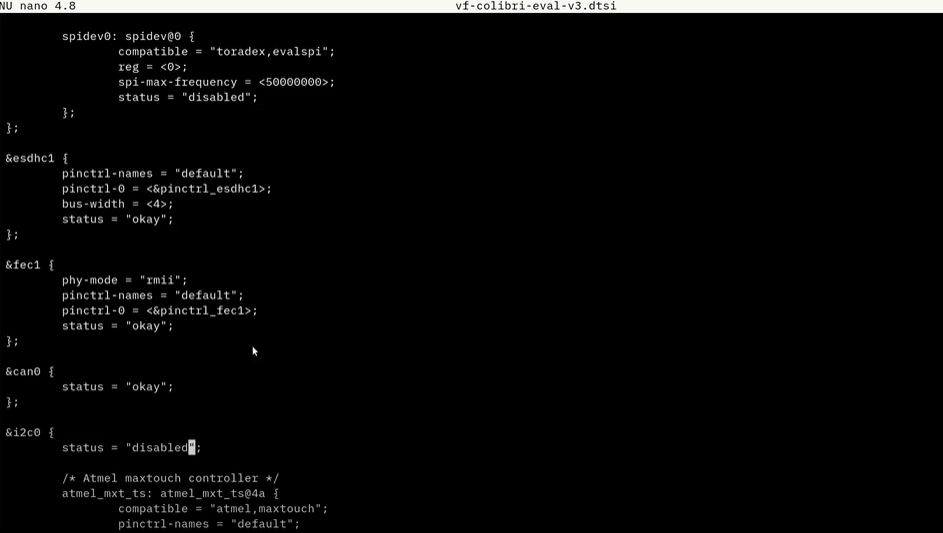

# Implementação do Protocolo CAN para placa Toradex Colibri VF50 e Mbed - Controle da Formiga Mecatrônica

<h2 align="center"> SEM0544 - Sistemas Embarcados

</h2>

<h3 align="center"> 
  
Universidade de São Paulo 

Escola de Engenharia de São Carlos 

Departamento de Engenharia Elétrica e Computação 
 
 

</h3>

<h3 align="center"> 
</h3>
  
Professores: 

**Glauco Augusto de Paula Caurin** 

**Daniel Varela Magalhães**

Alunos:

**[Gustavo Batistom Vasquez](https://github.com/gustavobvasquez)** *n° USP: 9805150* 

**[Leonardo Ferreira Rosa Zago](https://github.com/leonardozado)** *n° USP: 9805355* 

**[Leonardo Rodrigues de Ávila Oliverira](https://github.com/Leonardorodriguesoliveira)** *n° USP: 9805205* 

<h5 align="center"> 
  
31 de julho de 2021

</h5>

# 1) Objetivos
  O projeto se baseia no funcionamento de 12 motores PWM que realizam a movimentação da formiga mecatrônica através de utilização de sistemas embarcados. Para isso, o objetivo foi desenvolver a comunicação, através do protocolo de comunicacão CAN, entre uma placa com linux embarcado (Toradex VF50) e a placa da Mbed (LPC1768), onde os motores estarão conectados as portas PWM. Desta forma o projeto tem a flexibilidade de contar com um sistema operacional, para inclusão de diversas funcionalidades futuras, e também pode-se utilizar do poder de processamento existênte na Mbed. 

# 2) Materiais e métodos
  Para a realização do projeto, foram utilizadas a placa Colibri VF50 da Toradex e 2 placas Mbed LPC1768. O diagrama de blocos a seguir demonstra a estrutura de comunicação desde a placa com o S.O. embarcado até a informação de PWM dos motores.
  
  </h3>

<h3 align="center"> 
</h3>

  O fluxo de funciomento será da seguinte forma, a placa da toradex envia uma mensagem de funcionamento via protocolo Can para as placas da Mbed. Recebendo esta informação a placa da Mbed executa a rotina programada para controle dos PWM de acordo com a mensagem recebida (Levantan, Anda para frente, Abaixa, Vire a direita, etc.)
  
  

# 3) Desenvolvimento

## 3.1) Habilitação dos pinos para comunicação CAN na placa (CAN0)

Inicialmente, o grupo encontrou um documento no site do fabricante da placa (Toradex) relatando algumas alterações necessárias para a adaptação da placa para emitir e receber protocolos de comunicação CAN. (segue o link de referência: https://developer.toradex.com/knowledge-base/can-linux#tab-bsp-5). Nele se evidenciam dois maneira diferentes de alterar alguns arquivos na placa para habilitar a forma de comunicação CAN0 entre os pinos 196/194 ou CAN1, utilizando-se dos pinos 63/55.

<h3 align="center"> 
</h3>

Adicionalmente, dessa mesma fonte, encontrou-se a informação que devido à versão do kernel linux disponível em nossa placa Colibri VF50 não é possível realizar device tree overlay, que são fragmentos especiais de device trees que permitem que você substitua partes específicas, antes de inicializar o sistema operacional. Ou seja, desse modo é possível aproveitar diversas camadas de software de uma placa semelhante e realizar apenas adequações necessárias ao kernel em uma camada mais exterior, aproveitando grande parte do que já foi desenvolvido e adaptado por outros desenvolvedores.

<h3 align="center"> 
</h3>

Para o download da respectiva Cross Toolchain necessária, identificou inicialmente a versão do Embedded Linux BSP para uso da versão adequada. Realizando a consulta no artigo (segue o link de referência: https://developer.toradex.com/knowledge-base/embedded-linux-release-matrix) foi possível identificar a versão BSP: 2.8.7 do Linux em nossa placa. 

<h3 align="center"> 
</h3>

Em seguida, acessou-se o link para download da Cross Toolchain correspondente (segue link de referência: https://developer.toradex.com/knowledge-base/build-u-boot-and-linux-kernel-from-source-code#tab-embedded-linux-bsp-28). E realizou-se o donwload do software de compilação conforme indicado pelas linhas de comando abaixo.

<h3 align="center"> 
</h3>

Acessou-se o github da Toradex para encontrar o arquivo mencionado no artigo inicial. Acessando o caminho mencionado e mudando a versão para a toradex_vf_4.4, encontrou-se o arquivo arch/arm/boot/dts/vf-colibri-eval-v3.dtsi. Como foi encontrado referências mencionando o melhor uso de CAN0 para o nosso propósito, optou-se por essa opção. Nesse arquivo é possível identificar o status do nó de CAN0 que é necessário desabilitar o status do nó i2c0 e também setar o status do nó can0 para okay. Obersevação importante: os pinos 196/194 estão disponíveis fisicamente (no hardware) através dos pinos 5/6 respectivamente do expansion header da carrier board Viola.

O repositório foi clonado para que as mudanças mencionadas pudessem ser realizadas, utilizando-se do comando $ git clone -b toradex_vf_4.4 git://git.toradex.com/Linux-toradex.git (para clonar o nosso branch específico desejado). E as mudanças mencionadas anteriormente foram realizadas conforme a figura abaixo.

<h3 align="center"> 
</h3>

O último passo consiste em compilar o device tree que alteramos. Analisando o Kernel Compilation, devemos alterar as configurações de como o Kernel será compilado. Para a placa em questão, deve ser o colibri_vf_defconfig. Assim, executou-se o comando make colibri_vf_defconfig. Posteriormente, foi feito o build da device tree alterada, ou seja, vf500-colibri-eval-v3.dtb. É necessário, por último realizar a substituição do arquivo .dtb pelo arquivo compilado. Entretanto, não se conseguiu localizar o arquivo correto para realizar a substituição ou achar o arquivo compilado para a placa. Dessa forma, o time não conseguiu identificar a origem do problema: se consiste na compilação do arquivo para a placa ou achar o arquivo respectivo já existente.

## 3.2) Kartey

## 3.3) Reits

# 4) Concluões finais
--> Protocolo Can facilita a adiação de novos componentes "sistema de varal"
--> Parte do codigo estar na mbed diminui o processamento realizado no processador com S.O. possibilitanto adição de novas funcionalidades no futuro (câmera, braço robótico entre outros)

